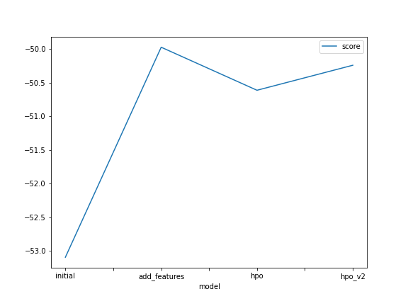
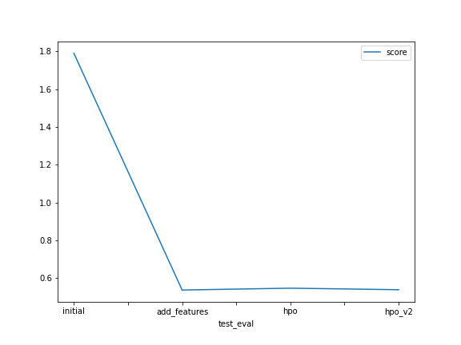

# Report: Predict Bike Sharing Demand with AutoGluon Solution
#### NAME HERE
Hasarindu Perera

## Initial Training
### What did you realize when you tried to submit your predictions? What changes were needed to the output of the predictor to submit your results?

Initially, I encountered an issue because the `evaluate` function did not work on the `predictor`. However, I discovered that I needed to use the `predict` function on the `predictor` instead. Additionally, I had to ensure that the predicted values did not contain any negative values by setting them to zero. I also modified the submission dataframe to include the new prediction values, which were then added to the CSV file for submission on Kaggle.

### What was the top ranked model that performed?

The `WeightedEnsemble_L3` of the `add_features` model performed the best for me. I find it somewhat puzzling that my hyperparameter optimization (HPO) model did not perform as I expected, and I plan to investigate this further.

## Exploratory data analysis and feature creation
### What did the exploratory analysis find and how did you add additional features?

During the exploratory analysis, I observed that weather and windspeed were somewhat positively correlated with the bike sharing count, while humidity showed a negative correlation. To enhance the model's training, I split the `datetime` feature into three separate features: `hour`, `day`, and `month`.

### How much better did your model preform after adding additional features and why do you think that is?

After adding the additional features, the Kaggle score improved significantly from `1.78996` to `0.53781`. I believe this improvement is due to the model being able to better understand the variations in time-related patterns.

## Hyper parameter tuning
### How much better did your model preform after trying different hyper parameters?

In this scenario, the model did not perform as well after hyperparameter tuning. It fell slightly behind the previous model. Despite attempting different hyperparameter presets, the performance did not improve significantly.

### If you were given more time with this dataset, where do you think you would spend more time?

Given more time, I would focus on understanding why the hyperparameter optimization did not lead to an improved model score. Further analysis and experimentation would be necessary to uncover the reasons behind this outcome.

### Create a table with the models you ran, the hyperparameters modified, and the kaggle score.

|model|hyperparameters|searcher|scheduler|num_trials|presets|score|
|--|--|--|--|--|--|--|
|initial|default|default|default|default|best_quality|1.78996|
|add_features|default|default|default|default|best_quality|0.53781|
|hpo|custom|auto|local|5|best_quality|0.54765|
|hpo_v2|light|auto|local|5|high_quality|0.53948|

### Create a line plot showing the top model score for the three (or more) training runs during the project.

### Create a line plot showing the top kaggle score for the three (or more) prediction submissions during the project.

## Summary

This project provided valuable insights into how AutoGluon can be leveraged to train models using various machine learning architectures, enabling the selection of the best approach for optimal results. Despite encountering challenges with hyperparameter optimization, the project yielded improved performance by incorporating additional features and time-related patterns.
